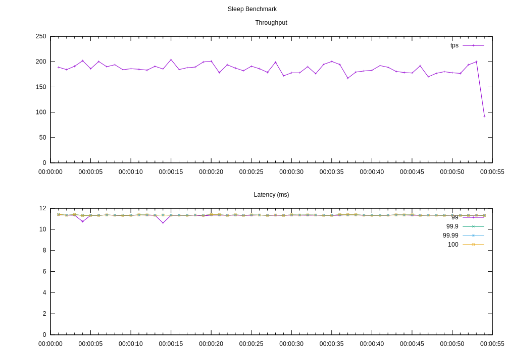

microbe
=======

A simple **micro be**nchmark helper for measuring throughput and latency of
operations using [HDR histogram](http://hdrhistogram.org/).

This project is very much a work in progress.

Usage
-----

### `microbe.core`

- `run`
- `<>`

```clojure
(require '[microbe.core :as mcb :refer [<>]])

;;; Reports throughput and latency metrics while evaluating the forms every 1 second
(mcb/run
 {:interval 1 :output-dir "result" :title "Sleep Benchmark"}
 (dotimes [i 10000]
   ;; Wrap unit operation to measure with <> function
   (<> (Thread/sleep (rand-int 10)))))
```

* `run` returns the summary of the run as a map
* The metrics during the run will be stored as a CSV file in `:output-dir`. If
  `gnuplot` executable is available on the system, throughput/latency plot
  will also be generated as a SVG file in that directory.



#### Default options for `run`

```clojure
{:interval 5
 :logger microbe.core/console-logger
 :title "Benchmark Result"
 :width 1000
 :height 700
 :output-dir "result"}
```

### `microbe.util`

`microbe.util` namespace provides a few functions that are useful for micro
benchmarks.

- `rand-str`
- `ticker`
- `with-thread-pool`

```clojure
(require '[microbe.util :as util])

;;; Generates random base62 string of length 100.
(util/rand-str 100)

;;; `ticker` returns a lazy sequence that outputs numeric integers
;;; in increasing order in the given frequency.
;;; The following code will take at least 10 seconds to finish.
(doseq [_ (take 10000 (util/ticker 1000))]
  (do 'something))

;;; Evaluates the forms with a thread pool
(util/with-thread-pool [idx 100 :threads 10]
  (println (str "(" idx ")")))
(util/with-thread-pool [item (range 100) :threads 10]
  (println (str "(" item ")")))
(util/with-thread-pool [item (range 100) :threads 10 :frequency 100]
  (println (str "(" item ")")))
(util/with-thread-pool [item (range 100) :threads 10 :frequency 10 :duration 3]
  (println (str "(" item ")")))
```

## License

The MIT License (MIT)

Copyright (c) 2019 Junegunn Choi
